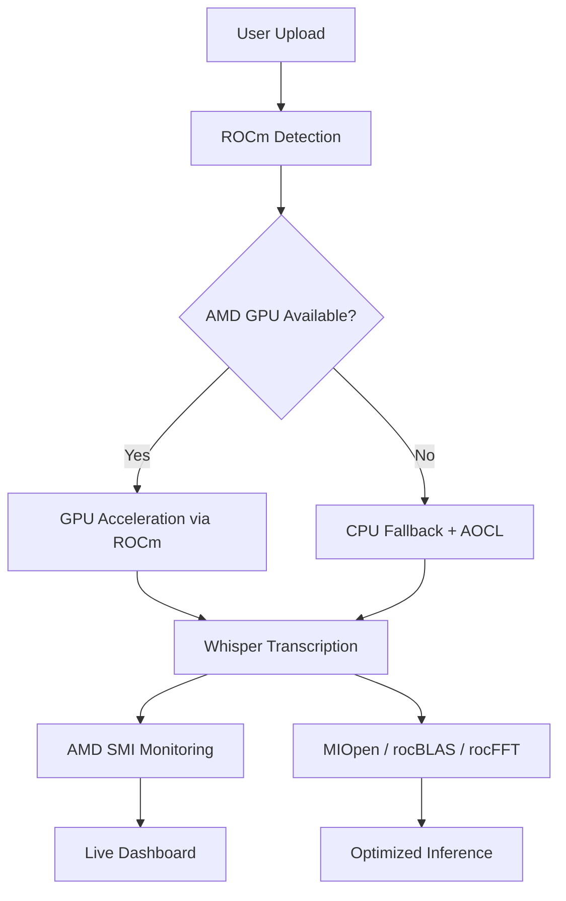

# 🎬 CapVideo – AMD Accelerated AI Video Captioning  

<p align="center">
  
  
  
  
  
</p>

<p align="center">
<strong>🏆 AMD Slingshot 2026 Submission – Team StellarGirls</strong>
</p>

---

## 📌 Overview

**CapVideo** is a production ready, AMD accelerated AI web application that automatically generates and embeds customizable subtitles into videos.

Users can upload local video files or provide YouTube URLs. The system leverages OpenAI Whisper (running on PyTorch with AMD ROCm™ acceleration) to transcribe speech with high accuracy. Captions can be fully customized and permanently burned into videos using FFmpeg.

A built-in **real-time AMD Performance Dashboard** monitors GPU metrics such as temperature, utilization, VRAM usage, and power consumption.

---

## ✨ Key Features

| Category | Capabilities |
|----------|-------------|
| 🤖 AI Transcription | High-accuracy speech-to-text using Whisper |
| ⚡ AMD Acceleration | Up to 10× faster inference on AMD Instinct™ / Radeon™ GPUs |
| 📊 Performance Dashboard | Real-time GPU telemetry via AMD SMI |
| 🎨 Advanced Styling | 100+ subtitle customization options |
| 📺 Flexible Input | YouTube URLs + local uploads (MP4, AVI, MOV, MKV, etc.) |
| 👤 User Management | JWT authentication, dashboard, history tracking |
| ⭐ Favorites | Bookmark processed videos |
| 🔍 Search & Filter | Filter by date, filename, status |
| 🌓 Theme Support | Light/Dark mode toggle |
| 🔔 Notifications | Browser alerts upon completion |
| 🧹 Auto Cleanup | Automatic file deletion after 2 hours |
| 🐳 Dockerized | Easy containerized deployment |

---

## 🛠 Technology Stack

### Frontend
- HTML5 / CSS3  
- TailwindCSS  
- JavaScript (ES6)  
- Font Awesome  

### Backend
- Python 3.9+  
- Flask  
- Flask-CORS  
- JWT Authentication  
- Gunicorn  
- psutil  

### AMD Technology Integration

| AMD Library | Purpose | Integration |
|-------------|----------|------------|
| AMD ROCm™ | GPU acceleration | PyTorch ROCm backend |
| AMD SMI | GPU monitoring | `amdsmi` Python package |
| AMD AOCL | CPU-optimized NumPy | AOCL Python wheels |
| AMD MIOpen | ML primitives | Via ROCm + PyTorch |
| rocBLAS | Linear algebra acceleration | ROCm backend |
| rocFFT | Fast Fourier transforms | ROCm backend |

### AI / ML
- OpenAI Whisper  
- PyTorch (ROCm-enabled)  
- NumPy (AOCL-optimized)  

### Video Processing
- FFmpeg  
- yt-dlp  
- SRT / ASS subtitle generation  

### Deployment
- Docker  
- Hugging Face Spaces  
- GitHub  

---

## ⚡ AMD Integration Architecture


## 📊 AMD Performance Dashboard

When deployed on AMD hardware, **CapVideo** provides a real-time performance dashboard designed to showcase hardware acceleration and system telemetry.

The dashboard displays:

- **ROCm Version** – Active ROCm runtime detected on the system  
- **Library Status** – Verification of integrated AMD libraries:  
  - AMD SMI  
  - AOCL  
  - MIOpen  
  - rocBLAS  
  - rocFFT  
- **GPU Temperature** – Live thermal monitoring  
- **GPU Utilization (%)** – Real-time compute usage  
- **VRAM Usage** – Memory allocation tracking  
- **Power Consumption** – Active GPU power draw  

This dashboard highlights transparent AMD ecosystem integration and provides clear visibility into system performance during inference.

> On systems without AMD hardware, CapVideo automatically switches to a CPU-optimized execution mode using AOCL acceleration, while clearly indicating fallback status to the user.

---

## 🚀 Getting Started

### Prerequisites

Before running CapVideo, ensure the following dependencies are installed:

- **Python 3.9 or higher**
- **FFmpeg** (for video processing and subtitle embedding)
- **Git** (for repository cloning)

Optional (for enhanced performance and deployment):

- **Docker** (for containerized deployment)
- **AMD GPU with ROCm support** (for hardware acceleration) 

---

## 💻 Local Installation

Follow the steps below to set up **CapVideo** in a local development environment.

```
# 1. Clone repository
git clone https://github.com/hafsakhan09090/CapVideo.git
cd CapVideo

# 2. Create virtual environment
python -m venv venv
source venv/bin/activate        # Linux / macOS
# or
venv\Scripts\activate           # Windows

# 3. Install PyTorch
# CPU Version
pip install torch==2.0.1 torchaudio==2.0.1 --index-url https://download.pytorch.org/whl/cpu

# AMD ROCm Version
pip install torch==2.0.1+rocm5.4.2 torchaudio==2.0.2+rocm5.4.2 --index-url https://download.pytorch.org/whl/rocm5.4.2

# 4. Install AMD SMI (optional)
pip install amdsmi

# 5. Install dependencies
pip install -r requirements.txt
pip install git+https://github.com/openai/whisper.git

# 6. Run application
python app.py
```

---

## 🐳 Docker Deployment

CapVideo supports containerized deployment for consistent, portable execution across environments.

---

### 📦 Build the Docker Image

```bash
docker build -t capvideo 
docker run -p 7860:7860 capvideo
http://localhost:7860
```
---

### ⚡ AMD GPU Passthrough (Linux with ROCm)

To enable hardware acceleration on systems equipped with AMD GPUs and ROCm support, run the container with device access enabled:

```bash
docker run \
  --device=/dev/kfd \
  --device=/dev/dri \
  --group-add=video \
  -p 7860:7860 \
  capvideo
```

---

## 🌐 Live Demo

Experience **CapVideo** live on Hugging Face Spaces:

👉 https://huggingface.co/spaces/hafsakhan09090/CapVideo  

The hosted demo showcases the full application workflow in CPU mode with graceful fallback behavior.

> ⚡ For complete AMD GPU acceleration and the real-time performance dashboard, deploy locally on a system with AMD hardware and ROCm support.
